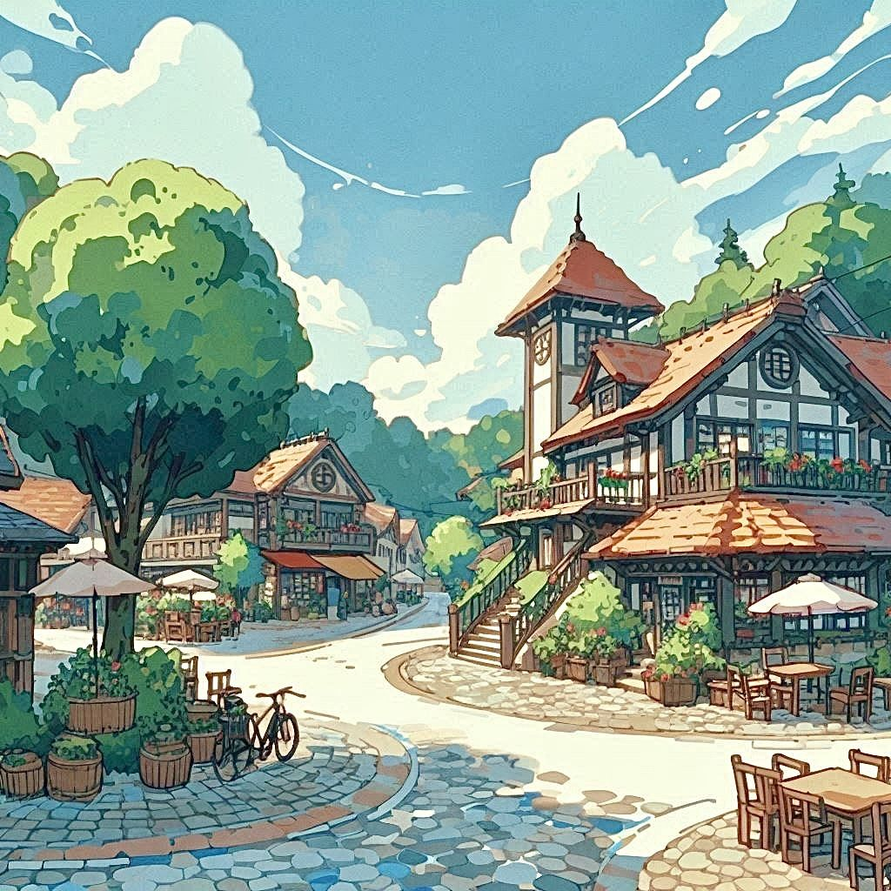
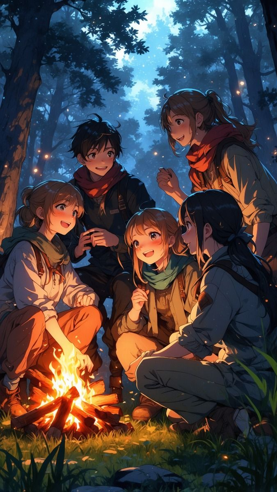
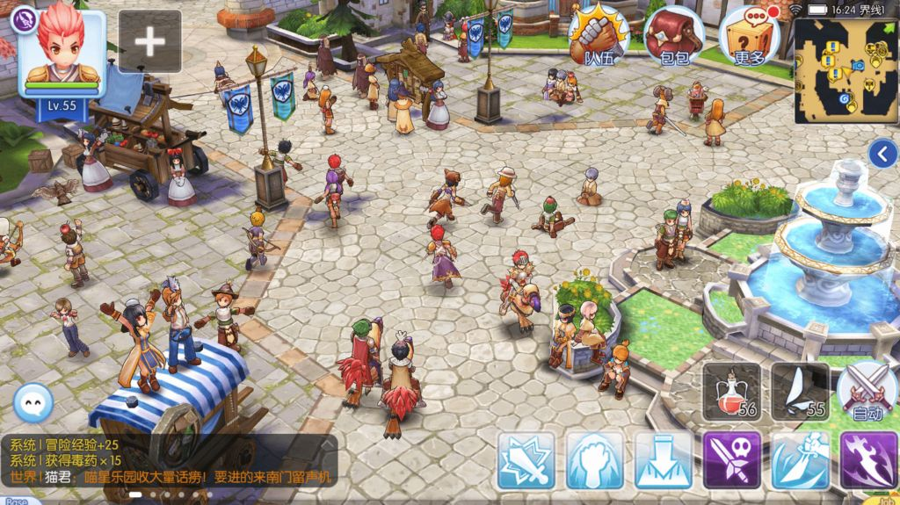

# 🎨 06 - Arte & Estilo

> [!ABSTRACT] 💡 Em uma frase
> 3D Stylized com câmera isométrica — um visual vibrante no Mundo de Ilusão que se transforma em monocromático na Visão Verdadeira, usando Bloodborne e Persona 5 como referências de tom.

---

## 🎨 Direção Visual (Decisões Confirmadas)

| Decisão | Escolha | Justificativa |
|---|---|---|
| **Estilo** | 3D Stylized | Escala bem entre mobile e PC; permite shaders expressivos |
| **Câmera** | Isométrica | Familiar para jogadores de MMORPG; mapas legíveis |
| **Paleta principal** | Vibrante, saturada | Representa o Mundo de Ilusão — aparentemente belo |
| **Paleta em combate** | Desaturada (tons de cinza) | Representa o Mundo Real — a verdade visível pela Visão Verdadeira |
| **Pixel Art** | ❌ Descartado | Escalabilidade limitada, animações de troca de equip complexas, shaders de Visão Verdadeira difíceis de implementar |

---

## 🌑 O Sistema Visual de Dois Mundos

O principal desafio artístico do Advento é que o mesmo espaço precisa parecer dois mundos distintos:

### Mundo de Ilusão (estado padrão)
- Paleta: colorida, vibrante, quente.
- Iluminação: suave, dia claro ou noite atmosférica.
- NPCs: aparência comum e normal.
- Sensação: um MMORPG bonito e aconchegante.

### Mundo Real / Visão Verdadeira (estado de combate/Fissura)
- Shader de desaturação global aplicado ao cenário (não à HUD).
- Paleta: tons de cinza e sombra; contrastes mais duros.
- Inimigos: overlays de cor aplicados (Tier 0 cinza, Tier 1 âmbar, Tier 2 vermelho).
- Fissuras: efeito de distorção visual na borda da zona de evento.
- Sensação: a beleza sumiu — a guerra está exposta.

---

## 🎨 Paleta de Cores por Reino

| Reino | Cor dominante | Tom espiritual |
|---|---|---|
| **Orizon** | Verde, azul celeste, branco | Alvorecer, esperança, fé nova |
| **Krost** | Cinza ferro, laranja brasa, vermelho carvão | Refino, provação, força |
| **Solari** | Dourado, areia, branco luminoso | Glória, proximidade, descanso |

---

## 🎭 Identidade por Tipo de Entidade

| Tipo | Visual base | Visual na Visão Verdadeira |
|---|---|---|
| Monstros comuns | Criaturas normais do mundo | Distorcidos, com glow escuro |
| MVPs | Imponentes, design marcante | Aura de corrompimento intensa |
| Corrompidos | Humanos com distorção parcial | Forma humana visível mas monstruosa |
| Discípulo (jogador) | Normal, com equipamento | Sem overlay — aliado |
| NPCs | Completamente normais | Sem distorção — civis |
| O Irmão | Normal para todos | Emana luz sutil — só visível na Visão Verdadeira |

---

## 🖼️ Referências Visuais Confirmadas

| Referência | Elemento específico |
|---|---|
| **Bloodborne** | Atmosfera de mundo com camada oculta; arte de inimigos com formas reconhecíveis distorcidas |
| **Persona 5** | Transição impactante entre mundo comum e mundo espiritual; UI expressiva |
| **Ragnarok Online** | Estilo MMORPG isométrico de referência; conforto do sistema |
| **Prototype** (Infected Vision) | Shader de percepção especial aplicado ao mundo; inspiração direta para Visão Verdadeira |

|  |  |
| ------------------------------------ | ------------------------------------ |
|  | |

---

## 🔧 Diretrizes Técnicas (Godot)

- **Shader de desaturação:** Global (pós-processamento); `WorldEnvironment` node com `Environment.saturation` interpolado.
- **Overlay de tier:** Material individual por entidade; parâmetro `overlay_color` via shader customizado.
- **Iluminação:** Stylized — sem PBR fotorrealista; flat shading com contornos sutis.
- **Animações:** Rigged 3D; mínimo 4 animações por classe (idle, walk, attack, skill).
- **Fissuras:** Partículas + distortion shader; VFX com `GPUParticles3D`.

---

## 🔗 Conexões Relacionadas

- ⬅️ **Pai:** [ADVENTO](../index.md)
- 🏠 **Home:** [ADVENTO](../index.md)
- ⚙️ **Mecânica:** [Sistema de Combate](../gameplay/sistema-de-combate.md) (shader de Visão Verdadeira)
- ⚙️ **Técnico:** [Comunicação Client-Server](../sistema-tecnico/arquitetura/comunicacao-client-server.md) (pacote tier_cor)
- 📱 **UI:** [UI](../ui/07-ui.md)

*Última atualização: 2026-04-19*
