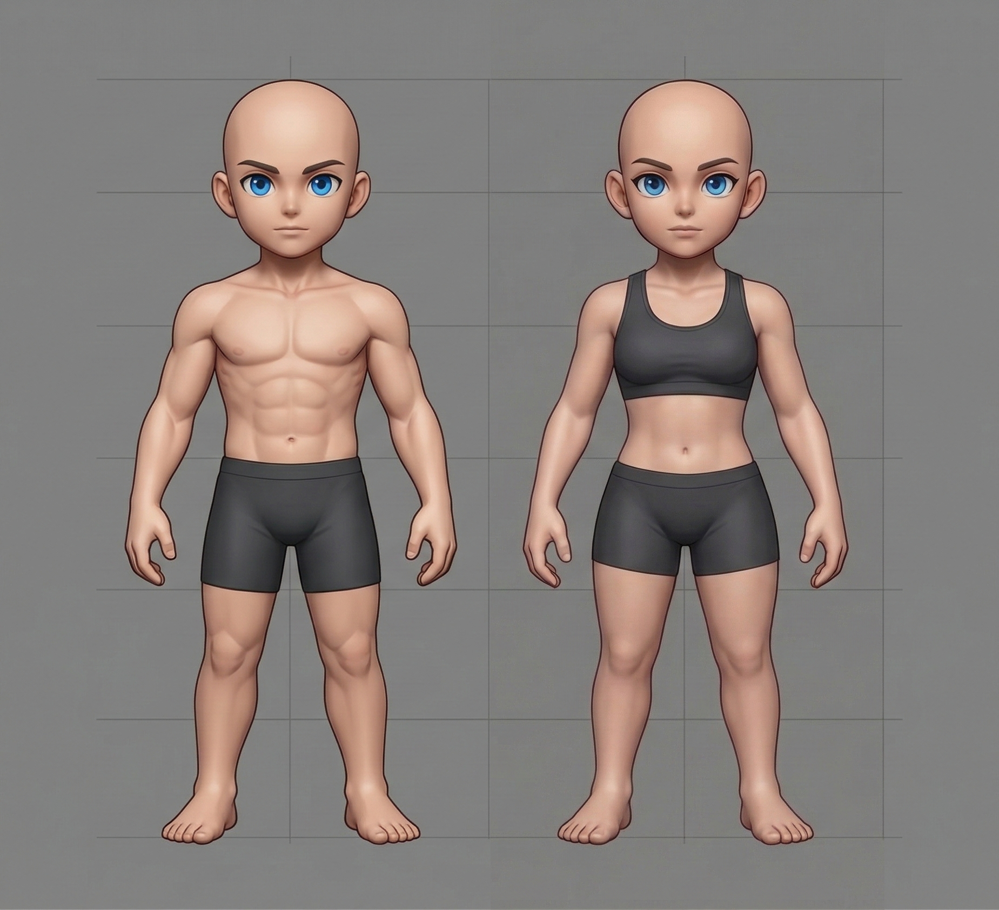

# 🛡️ Classes e Evoluções (Graus de Ministério)

> [!ABSTRACT] 💡 Em uma frase
> As classes no ADVENTO não são apenas profissões, mas **Graus de Ministério**: diferentes formas de manifestar os dons e autoridade do Rei contra a corrupção do Véu.

---

## 🔝 Estrutura de Progressão
Os Discípulos progridem através de dois Tiers de evolução, especializando sua função no campo de batalha:

| Classe Primária (Tier I) | Evolução A: ST / Burst (Alvo Único) | Evolução B: AoE / Farm (Área) |
| :--- | :--- | :--- |
| **Guerreiro** | **Cavaleiro** | **Paladino** |
| **Padre** | **Sacerdote** | **Monge** |
| **Caçador** | **Elite** | **Guardião** |
| **Sábio** | **Profeta** | **Mártir** |
| **Justiceiro** | **Executor** | **Inquisitor** |

---

## 🎨 Identidade Visual e 3D (Godot)
Diretrizes para a modelagem e shaders das classes:

### ⚔️ Linhagem do [Guerreiro](classes/guerreiro.md)
- **Cavaleiro:** Foco em lanças, armaduras de placas polidas e penachos fluídos.
- **Paladino:** Foco em escudos imponentes, detalhes em ouro e auras de proteção.

### 🛐 Linhagem do [Clerigo](classes/clerigo.md)

- **Sacerdote:** Batas longas, cruzes e símbolos de pureza. Estilo clássico litúrgico.
- **Monge:** Faixas de combate, vestes curtas e ágeis. Estilo combate corpo-a-corpo.

### 🏹 Linhagem do [Caçador](classes/cacador.md)
- **Elite:** Arcos longos, insígnias de comando e postura militar.
- **Guardião:** Capuzes, peles e texturas de camuflagem (Sobrevivência).

### 📖 Linhagem do [Sábio](classes/sabio.md)
- **Profeta:** Cajados de madeira antiga, olhos brilhantes (Revelação) e mantos.
- **Mártir:** Livros abertos flutuando, auras de luz intensa e símbolos de sacrifício.

### ⚖️ Linhagem do [Justiceiro](classes/justiceiro.md)
- **Executor:** Lâminas duplas, visores tecnológicos/místicos e foco em agilidade.
- **Inquisitor:** Capas pesadas, sombras ou fogo nos pés (Purificação pelo fogo).

---

## 🧠 Análise do Agente
> Esta divisão entre **ST (Single Target)** e **AoE (Area of Effect)** é fundamental para o balanceamento do rAthena. O fato de cada evolução ter uma identidade visual distinta ajuda muito na legibilidade do jogo (PvP e instâncias). 

*Última atualização: {{date}}*
