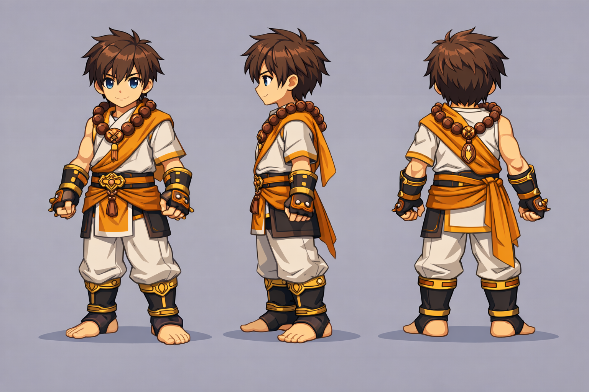

# 🛐 Linhagem: Clerigo

> [!ABSTRACT] 💡 Em uma frase
> O canal da graça e cura, focado em suporte espiritual e combate sagrado.

---
## 🔱 Evoluções

### ⛪ Sacerdote (ST / Burst - Suporte)
- **Foco:** Cura intensa, buffs sagrados e proteção divina direta.
- **Identidade Visual:** Batas longas, estolas, cruzes e tons de branco e azul.
- **Lore:** O mediador da paz do Rei, focado em restaurar a integridade do vaso (HP) dos aliados.

### 👊 Monge (AoE / Farm - Combate)
- **Foco:** Combate corpo-a-corpo rápido, combos e técnicas de área.
- **Identidade Visual:** Faixas de combate, vestes curtas e calçados ágeis.
- **Lore:** O combatente disciplinado que usa a força física para dissipar o mal em massa.

---

## 🔗 Conexões Relacionadas
- ⬅️ **Pai:** [Classes e Evoluções](../classes-e-evolucoes.md)
