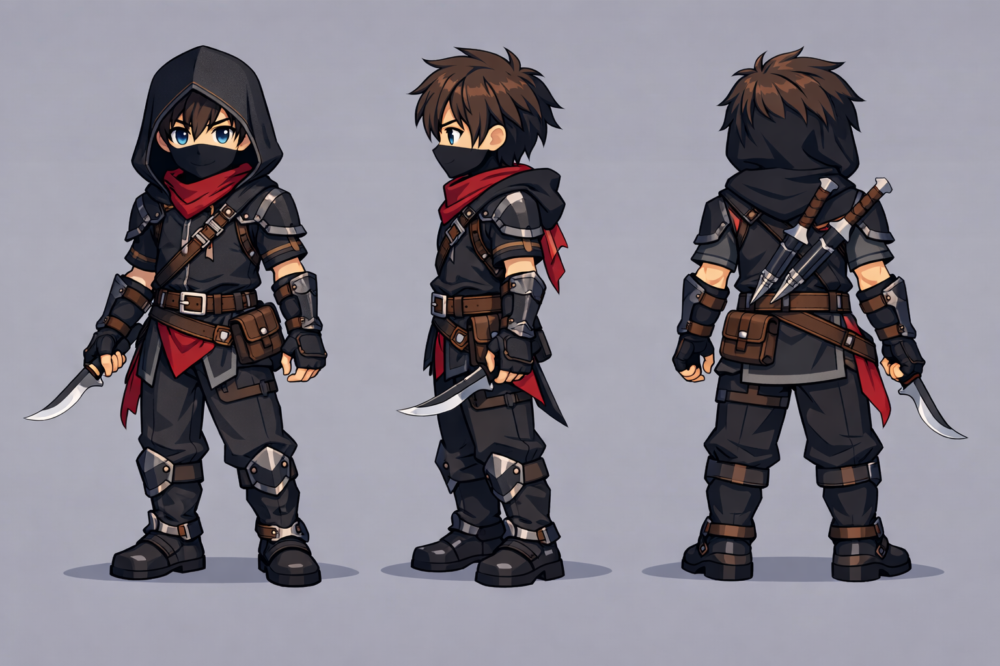

# ⚖️ Linhagem: Justiceiro

> [!ABSTRACT] 💡 Em uma frase
> A mão da justiça e purificação, focada em velocidade, retribuição e agilidade.

---

## 🔱 Evoluções

### 🗡️ Executor (ST / Burst)
- **Foco:** Velocidade extrema, furtividade espiritual e golpes fatais.
- **Identidade Visual:** Lâminas duplas, visores místicos e trajes ajustados e escuros.
- **Lore:** O executor da vontade do Rei, agindo rápido onde a corrupção é mais densa.

### 🔥 Inquisitor (AoE / Farm)
- **Foco:** Chamas de purificação, capas pesadas e combate de área através da presença.
- **Identidade Visual:** Capas pesadas, sombras ou chamas nos pés e elmos fechados.
- **Lore:** O juiz implacável que caminha entre hordas purificando tudo o que toca a sua luz.

---

## 🔗 Conexões Relacionadas
- ⬅️ **Pai:** [[🛡️ Classes e Evoluções]]
