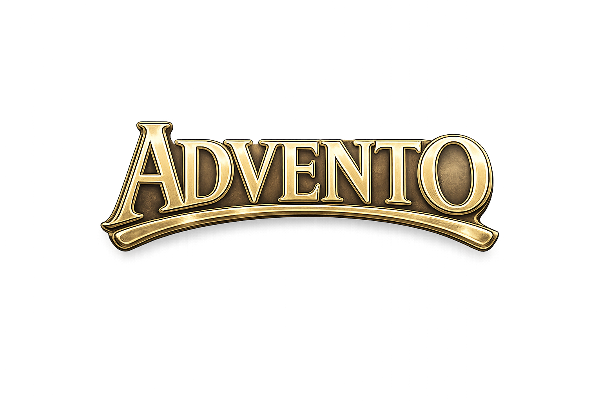

# 🏰 ADVENTO

> [!ABSTRACT] 💡 Resumo do Projeto
> **ADVENTO** é um MMORPG de fantasia sombria e alegoria cristã inspirado em *"O Peregrino"*. O jogo transporta o jogador para o continente de **Aethelgard**, onde a realidade visível é apenas uma fachada (O Véu) que oculta uma batalha espiritual milenar entre a Luz e as Trevas.

---

## 📖 Sinopse da Lore
1. Em um mundo fragmentado pela Queda, a humanidade caminha sob o domínio do esquecimento.
2. O que antes era uma realidade plena e luminosa, agora é percebido apenas através do "Véu".
3. Esta barreira espiritual não é uma muralha física, mas uma cegueira herdada que oculta a Verdade.
4. Além do Véu, uma Guerra Invisível é travada em cada centelha de pensamento e sopro de vida.
5. De um lado, as hordas do Adversário, que sussurram mentiras e destilam a corrupção da alma.
6. Do outro, o chamado persistente do Mestre, convidando o homem de volta à sua origem divina.
7. Você desperta em Primordia, a terra dos novos começos, munido de nada além de um Livro sagrado.
8. Este Livro não é um objeto comum, mas uma bússola que permite vislumbrar o que está oculto.
9. Através dele, as paisagens de Aethelgard revelam nomes duais que manifestam sua natureza real.
10. Onde o mundo vê perigos e riquezas, o Peregrino enxerga provas e ferramentas de santificação.
11. Cada passo no caminho estreito é um ato de resistência contra as trevas e os Principados.
12. Os "Corrompidos" espreitam nos vales, reflexos deformados daqueles que cederam ao desespero.
13. Sua missão não é apenas sobreviver, mas atravessar as regiões que espelham o progresso da alma.
14. Da Cidade da Destruição até as margens do Rio da Morte, o teste é constante e absoluto.
15. A força de um Peregrino não reside em sua espada, mas no discernimento que rasga o Véu.
16. Cada vitória sobre o mal é um fragmento de visão recuperada, uma luz que desafia a sombra.
17. O destino final é a Cidade Celestial, mas o portão é estreito e poucos são os que o encontram.
18. Ao longo da jornada, a comunhão com outros despertos fortalece o espírito para o embate final.
19. Pois nesta terra de sombras e reflexos, a única saída é através da Senda da Santidade.
20. Prepare seu coração, ajuste seus olhos e responda ao chamado: o Advento está próximo.

---

## 🗺️ Estrutura do GDD (Índice)

> [!IMPORTANT] Use os links abaixo para navegar pelas entranhas do projeto.

### 🏛️ 01 - [Visão Geral](visao-geral/01-visao-geral.md)
> Conceitos fundamentais, pilares e experiência desejada.

### 📕 02 - [Lore](lore/02-lore.md)
> A história do mundo, capítulos da queda e bestiário.

### 🌍 03 - [Mundo](mundo/03-mundo.md)
> Geografia do caminho e detalhes das regiões de Aethelgard.

### ⚔️ 04 - [Gameplay](gameplay/04-gameplay.md)
> Mecânicas de combate, classes e sistemas de evolução.

### 🖥️ 05 - [Sistema Técnico](sistema-tecnico/05-sistema-tecnico.md)
> Arquitetura do servidor, módulos e decisões de engenharia.

### 🎨 06 - [Arte & Estilo](arte-e-estilo/06-arte-e-estilo.md)
> Guia visual, referências e estética do projeto.

### 📱 07 - [UI](ui/07-ui.md)
> Mockups, design de interface e experiência de usuário.

### 🗺️ 08 - [Roadmap](roadmap/08-roadmap.md)
> Marcos de desenvolvimento e status atual do projeto.

### 💡 09 - [Ideias Soltas](ideias-soltas/09-ideias-soltas.md)
> Rascunhos, brainstormings e mecânicas em análise.

---

## 🔗 Conexões Relacionadas
- 🏠 **Home:** [ADVENTO](index.md)
- 📡 **Server:** [advento-server](file:///c:/xampp/htdocs/advento/advento-server)
- 🎮 **Client:** [advento-online](file:///c:/xampp/htdocs/advento/advento-client/advento-online)

---

## 🧠 Análise do Agente
> Este arquivo centraliza todo o conhecimento do projeto. A nova estrutura permite que qualquer desenvolvedor entenda instantaneamente o propósito do jogo e a profundidade da sua lore antes de mergulhar nos detalhes técnicos.

*Última atualização: 2026-04-10*