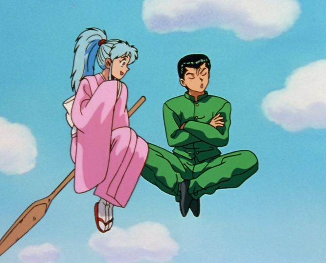
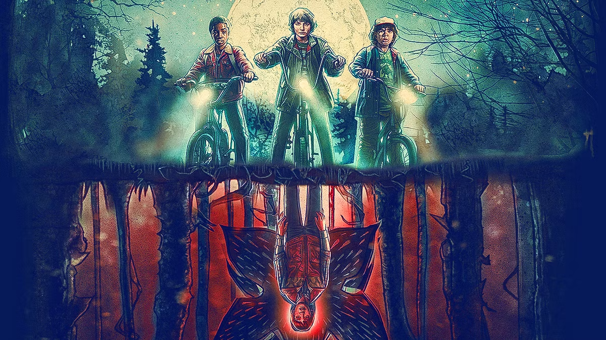
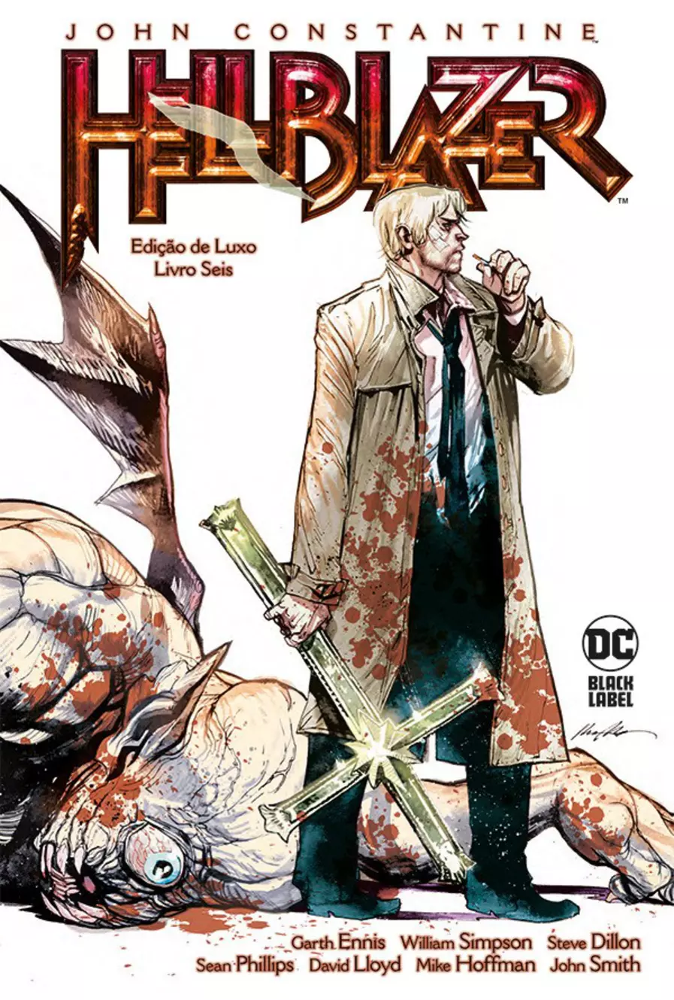
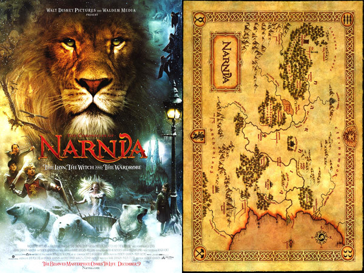
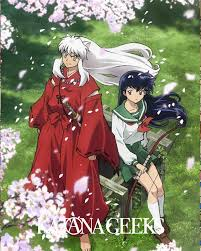
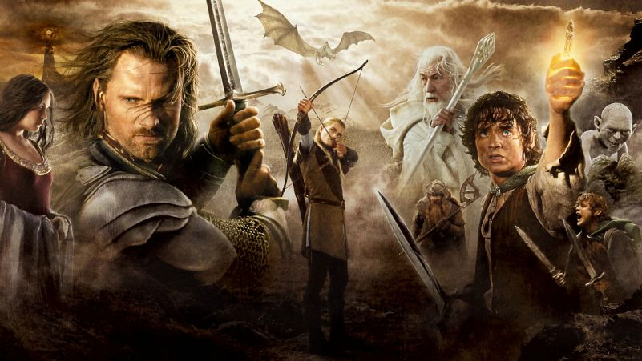

# 🧠 01 - Visão Geral

> [!QUOTE] A alma do projeto — o "porquê" do Advento existir.

---

## 🎯 O Projeto em Uma Frase

**Advento** é um MMORPG cristão sobre guerra espiritual, construído sobre rAthena + Godot, onde cada mecânica tem embasamento teológico: o jogador não mata inimigos — expulsa; não sobe de nível — cresce em santidade; não explora um mundo genérico — retorna ao Jardim Eterno.

---

## 🏛️ Pilares do Projeto

| Documento | Conteúdo |
|---|---|
| [Conceito Central](pilares/conceito-central.md) | O que é o "Advento"? A dualidade de realidades; O Livro como interface |
| [Objetivo do jogo](pilares/objetivo-do-jogo.md) | Loop de resistência + Santidade como progressão |
| [Diferencial](pilares/diferencial.md) | Expulsão vs. matar; Parusia como âncora de MMO; profundidade teológica |
| [Manifesto do Projeto (Rascunho 1.0)](pilares/manifesto-do-projeto-rascunho-10.md) | Declaração de visão e valores do projeto |
| [Intro](pilares/intro.md) | Como o prólogo (O Despertar) é apresentado |

---

## 🎭 Experiência e Público

| Documento | Conteúdo |
|---|---|
| [Experiência do Jogador](experiencia/experiencia-do-jogador.md) | O que o jogador faz minuto a minuto |
| [Experiência Emocional](experiencia/experiencia-emocional.md) | Como o jogador deve se sentir em cada fase |
| [Sensação Desejada](experiencia/sensacao-desejada.md) | Tom, gênero e referências de sentimento |
| [Público-Alvo](experiencia/publico-alvo.md) | Quem é o jogador do Advento |

---

## ⚙️ Estrutura e Técnica

| Documento | Conteúdo |
|---|---|
| [Estrutura do Mundo](estrutura-e-tecnica/estrutura-do-mundo.md) | Os 3 reinos; tabela de progressão; sistema de nomes duais |
| [Linha Filosófica](estrutura-e-tecnica/linha-filosofica.md) | "O mal distorce, não cria" — fundamento ontológico |
| [Abordagem Técnica](estrutura-e-tecnica/abordagem-tecnica.md) | rAthena + Godot; cross-play mobile/PC |
| [Plataforma](estrutura-e-tecnica/plataforma.md) | Mobile/PC; HUD adaptada; câmera isométrica |
| [Conflito Central](estrutura-e-tecnica/conflito-central.md) | Hierarquia do mal; O Adversário; Principados |

---

## 🖼️ Referências Visuais Confirmadas

| Referência | Por quê |
|---|---|
| **Bloodborne** | Direção de arte; atmosfera de mundo com segunda camada de realidade |
| **Persona 5** | Transição entre mundo comum e mundo espiritual; paleta e impacto visual |
| **Ragnarok Online** | Base de sistema de combat/classes/economia |
| **Prototype** (Infected Vision) | Referência direta para o shader da Visão Verdadeira |

|  Como o Yusuke começa a ver o mundo espiritual e começa a caçar os demonios nesse plano simultaneo.                                                 |  O mundo invertido como algo que está acontecendo em paralelo com esse mundo, porém aqui a pessoa pode ir para lá em vez de ficar em simultaneo nos dois planos.                        |
| ------------------------------------------------------------------------------------------------------------------------------------------------------------------------------------------ | --------------------------------------------------------------------------------------------------------------------------------------------------------------------------------------------------------------------------- |
|  Literalmente um combate espiritual de um padre contra demonios                                                                                        | Aqui temos um exemplo de uma terra totalmente nova, Dessa forma não temos uma geografia real, temos um mundo totalmente novo. Aqui tudo funciona como uma linguagem alegorica.          |
|   Em InuYasha existe uma viagem no tempo, mediuns, demonios e uma busca para encontrar os fragmentos que amplificam os poderes magicos dos usuário. |  Semelhante a Nárnia, um mundo de fantasia e criaturas que fazem uma alegoria com o que existe no mundo real. Aqui fica mais nítida a diferença entre as individualidades de cada raça. |
| Demon Slayer = Duelo contra demonios e como eles de disfarçam no mundo real                                                                                                                | matrix e o mundo real                                                                                                                                                                                                       |
|                                                                                                                                                                                            | mob psycho 100                                                                                                                                                                                                              |

---

[⬅️ Voltar para o Início](../index.md)

*Última atualização: 2026-04-19*
